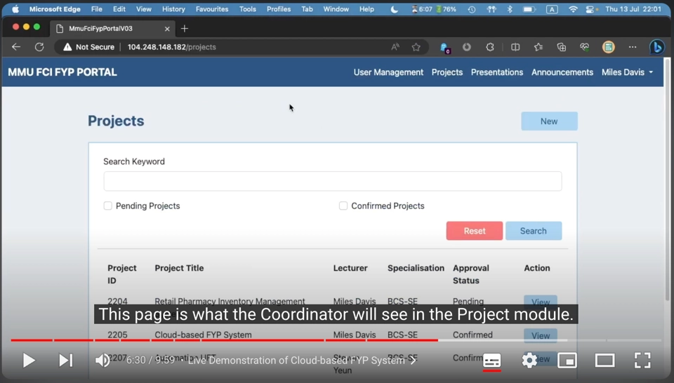

# MMU FCI FYP PORTAL 3.0

The source code of MMU (Multimedia University, Malaysia) FCI (Faculty of Computing and Informatics) FYP (Final Year Project) Portal v3.0, developed with Ruby on Rails framework. 

This project is a student's FYP and is intended for educational purposes only. This prototype has NO relation with the existing system being used by the faculty.

---

### If you are looking for a demo...
Cloning the project and run in your own machine is NOT recommended as strange behaviours, or even errors, might occur due to incomplete database entries in your local environment.

**The live version of the project was no longer accessible as of March 2024.** I no longer have any control over the IP address of `104.248.148.182`, where the project was hosted prior. Accessing the address above now will bring you to either nowhere or a random website.

You may watch [this video on YouTube](https://youtu.be/OS7e2fpfESI?si=l4vl372eC1U_bDpY&t=324) for a quick demonstration of certain features, as well as some technical background of the project.

---

### Build Pre-requisites
Please ensure the following packages are installed in your machine before cloning the repository.
1. Ruby 3.x
2. Rails 7.0.x
3. PostgreSQL 14.x
4. Any additional packages required by the packages listed above.

---

### Build Instructions
1. Clone the repository into your local machine.
2. Navigate to the project's root directory on Terminal app.
3. Execute `rails db:migrate` command to create database tables.
4. Execute the SQL queries to populate the database tables with data (not included in this repository).
5. Execute `./bin/dev` command to run the portal.

---

Developed by [YC Teoh](mailto:ycteoh@outlook.com) (2023)